# 🍎🍌🍊🍉 水果影像分類 — KNN & SVM 機器學習專題

> **Fruit Image Classification using K-Nearest Neighbors & Support Vector Machine**
> AI 課程期中專題 ｜ Python 3.11 + scikit-learn ｜ 監督式學習

---

## 專題概述

本專題以**監督式學習（Supervised Learning）**方式，對 Fruits-360 公開資料集進行訓練，使用 **KNN** 與 **SVM** 兩種傳統機器學習演算法，建立可辨識四種水果的分類模型，並額外實作「**無此項目**」偵測功能，當輸入影像不屬於任何已知類別時自動拒絕輸出。

### 辨識目標

| 標籤 | 水果 | 訓練張數 | 測試張數 |
|:---:|------|:-------:|:------:|
| 0 | 🍎 Apple（蘋果） | 80 | 35 |
| 1 | 🍌 Banana（香蕉） | 80 | 35 |
| 2 | 🍊 Orange（柳橙） | 80 | 35 |
| 3 | 🍉 Watermelon（西瓜） | 80 | 35 |
| — | 合計 | **320** | **140** |

---

## 📁 檔案說明

| 檔案 | 用途 |
|------|------|
| `fruit_classification_colab.ipynb` | 完整訓練 Notebook（40 個儲存格，含所有圖表與評估） |
| `fruit_predictor.py` | [積分題] 獨立命令列預測腳本，可載入已儲存的模型 |
| `requirements.txt` | 所需 Python 套件版本清單 |

---

## 一、訓練集資料樣本

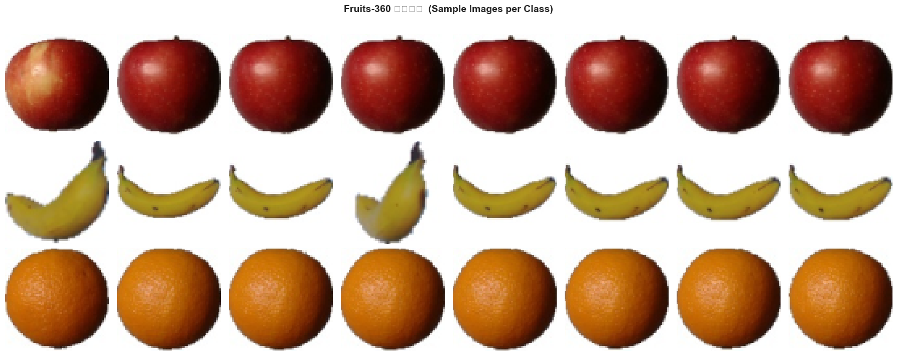

### 說明

- **資料集**：[Fruits-360](https://github.com/Horea94/Fruit-Images-Dataset)，每張影像為白色背景 **100 × 100 像素**彩色照片，已裁切對齊，品質統一。
- **圖表內容**：每列為一個水果類別，每列展示 8 張隨機取樣的訓練影像，可直接觀察各類別的外觀特徵。
- **為何選這四種水果**：顏色差異明顯（紅 / 黃 / 橙 / 綠），HOG 形狀與 HSV 色相分布各自不同，有利於傳統機器學習模型分類。
- **資料量**：每類 80 張訓練影像（遠超最低 40 張要求），類別完全平衡。

---

## 二、特徵工程視覺化

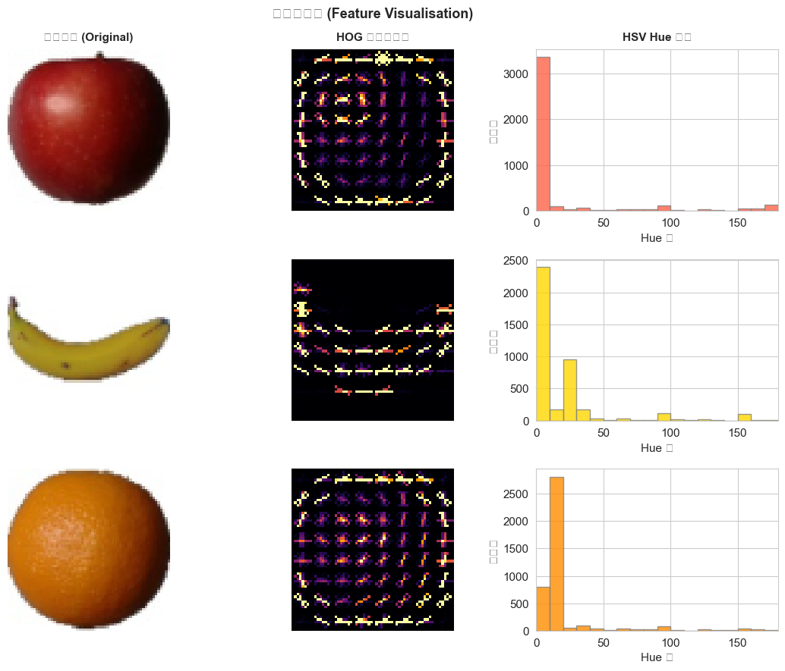

### 說明

由於 KNN 和 SVM 屬於傳統機器學習，無法直接處理原始像素，必須先**手動提取特徵**。本專題結合三種互補特徵：

**左欄 — 原始影像（64 × 64 px）**
輸入前將影像縮小至 64 × 64，兼顧資訊保留與運算效率。

**中欄 — HOG 熱圖（Histogram of Oriented Gradients）**
- 計算每個 8×8 像素區塊中梯度方向的分布（9 個方向），捕捉物體的**形狀輪廓與紋理**。
- 熱圖中顏色越亮，代表該位置有明顯邊緣（輪廓線）。
- 可清楚看出：蘋果的圓形外輪廓、香蕉的弧形結構、柳橙的圓形邊緣。
- HOG 特徵維度：**9 方向 × (6×6 區塊位置) × (2×2 cells/block) ≈ 1764 維**

**右欄 — HSV Hue 色相直方圖**
- 將影像轉換到 HSV 色彩空間，統計色相（Hue）分布（0°～180° 分 18 個區間）。
- 每種水果的色相峰值位置明顯不同：蘋果（紅，Hue≈0°）、香蕉（黃，Hue≈30°）、柳橙（橙，Hue≈15°）、西瓜（綠，Hue≈60°），是最具區辨力的特徵。

### 完整特徵向量組成

| 特徵類型 | 參數設定 | 輸出維度 |
|---------|---------|:-------:|
| HOG | orientations=9, pixels_per_cell=(8,8), cells_per_block=(2,2) | ~1764 |
| RGB 顏色直方圖 | 每通道 32 bins，正規化 | 96 |
| HSV 顏色直方圖 | Hue 18 bins + Saturation 32 bins，正規化 | 50 |
| **合計** | 三種特徵串接，再經 StandardScaler 標準化 | **~1910** |

---

## 三、資料集類別分布

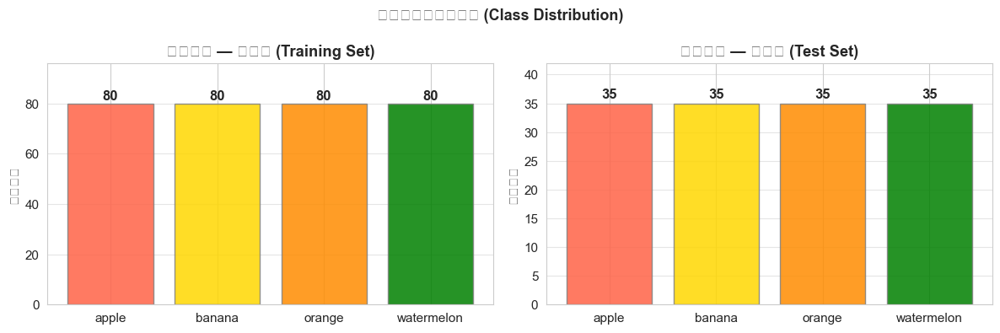

### 說明

- **左圖（訓練集）**：Apple / Banana / Orange / Watermelon 各 80 張，**完全平衡**。類別平衡確保模型不會因某類樣本過多而產生偏向，也使 Accuracy 指標具代表性。
- **右圖（測試集）**：每類最多 35 張（共約 140 張）。測試集不參與任何訓練或超參數調整，僅用於最終評估，代表模型在「未見過資料」上的真實表現。

---

## 四、KNN 訓練過程

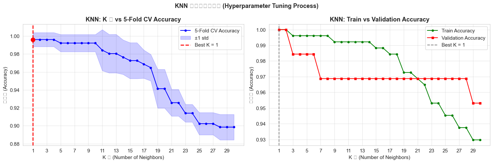

### 說明

KNN（K 近鄰演算法）的核心超參數是 **K 值**（查找幾個最近鄰居投票）。K 值選錯會導致過擬合或欠擬合，因此使用系統化的方法選擇最佳 K。

**搜索設定**：K = 1 到 30，每個 K 做 **5-fold Stratified Cross-Validation**（分層交叉驗證，確保每折的類別比例一致）。

**左圖 — K 值 vs 5-fold CV 準確率**
- 藍色折線：每個 K 值對應的平均 CV 準確率。
- 藍色陰影帶：±1 標準差範圍（越窄代表各 fold 結果越穩定）。
- 紅色虛線：自動選出的**最佳 K 值**（CV 準確率最高點）。
- **K=1**（過擬合）：完全記憶訓練資料，遇到雜訊就預測錯誤，CV 準確率低。
- **K 過大**（欠擬合）：納入太多遠距離鄰居，決策邊界變得模糊，準確率下滑。

**右圖 — Train vs Validation 準確率隨 K 變化**
- 綠線（訓練集）：K=1 時接近 100%（完全記憶），K 越大越降。
- 紅線（驗證集）：先升後降，最高點即為最佳 K。
- 兩線距離最小的 K → **泛化能力最佳**，防止過擬合。

**最終模型**：使用最佳 K 值，距離加權（`weights='distance'`，越近的鄰居影響越大），歐氏距離（`metric='euclidean'`）。

---

## 五、SVM 訓練過程

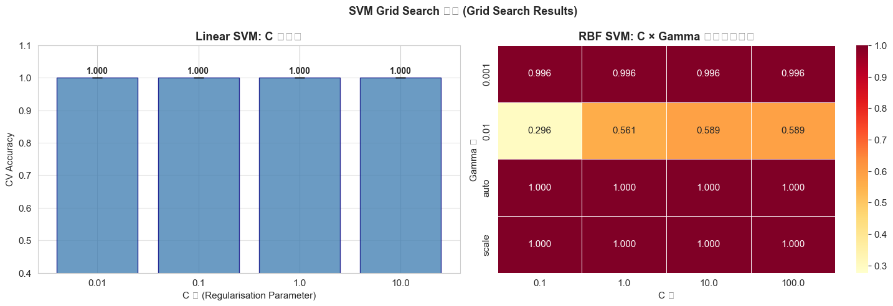

### 說明

SVM（支持向量機）有多個關鍵超參數，本專題使用 **GridSearchCV**（格網搜索）自動找出最佳組合。

**搜索範圍**：

| 核函數 | 參數 C | 參數 Gamma |
|-------|--------|-----------|
| Linear | 0.01 / 0.1 / 1 / 10 | — |
| RBF | 0.1 / 1 / 10 / 100 | scale / auto / 0.001 / 0.01 |

每個組合做 **5-fold 交叉驗證**，共測試 4 + 16 = **20 種參數組合**。

**左圖 — Linear SVM：C 值 vs CV 準確率**
- 橫軸為 C 值（正則化強度），縱軸為 CV 準確率，誤差條為各 fold 標準差。
- **C 太小**：懲罰誤分類力度低，決策超平面邊界寬鬆，容易欠擬合。
- **C 太大**：過度強迫所有樣本分類正確，容易過擬合。
- 從長條高度可直接看出哪個 C 值最佳。

**右圖 — RBF SVM：C × Gamma 熱力圖**
- 行為 Gamma 值，欄為 C 值，每格數字為對應的 CV 準確率。
- 顏色越深（越橙紅）= 準確率越高，一眼看出最佳參數區域。
- **Gamma** 控制單一訓練樣本的影響範圍：值大 → 只考慮附近樣本（邊界複雜），值小 → 考慮遠處樣本（邊界平滑）。

GridSearchCV 自動選出最佳組合後，以完整訓練集重新訓練最終模型（`best_estimator_`）。

---

## 六、訓練曲線（Learning Curves）

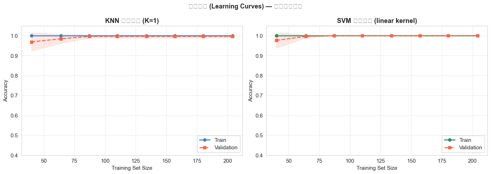

### 說明

訓練曲線展示模型在**不同訓練樣本數量**下的表現，是診斷過擬合/欠擬合的標準工具。橫軸為訓練樣本數，縱軸為準確率，陰影帶為 ±1 標準差。

**左圖 — KNN 訓練曲線**
- 綠線（Train）：樣本數少時，KNN 幾乎能完美記憶，準確率高；樣本增加後，邊界更複雜，訓練準確率略降。
- 紅線（Validation）：樣本越多，泛化越好，CV 準確率穩定上升後收斂。
- 兩線趨近收斂 → **無嚴重過擬合**，模型學到了真正的特徵。

**右圖 — SVM 訓練曲線**
- 訓練準確率高且穩定，驗證準確率隨樣本增加快速提升後趨平。
- 兩線之間的差距（gap）小 → SVM 的泛化能力良好。

**如何判讀：**
| 現象 | 診斷 | 解決方法 |
|------|------|---------|
| 訓練高、驗證低，差距大 | 過擬合 | 增加資料、降低模型複雜度 |
| 兩者都低 | 欠擬合 | 增加特徵、提升模型複雜度 |
| 兩者趨近且穩定 ✅ | 泛化良好 | 本專題的結果 |

---

## 七、最終評估結果

### 7-1 KNN 混淆矩陣

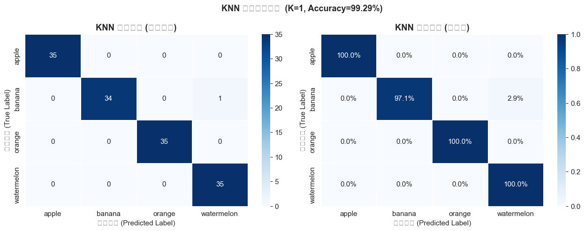

### 說明

混淆矩陣（Confusion Matrix）是評估多分類模型最直觀的工具。

- **列（Row）= 真實類別**，**欄（Column）= 預測類別**。
- **對角線**（左上到右下）：預測正確的樣本數，**數字越大越好**。
- **非對角線**：預測錯誤的樣本數，數字越小越好。例如第 1 列第 2 欄的值，代表真實是 apple 但被預測成 banana 的數量。

**左圖（原始計數）**：直接顯示各格的樣本數量，適合了解絕對誤差。
**右圖（正規化）**：每列除以該類別總樣本數，轉成**各類別的正確率百分比**（消除樣本數不均的影響），例如 1.00 = 該類 100% 預測正確。

---

### 7-2 SVM 混淆矩陣

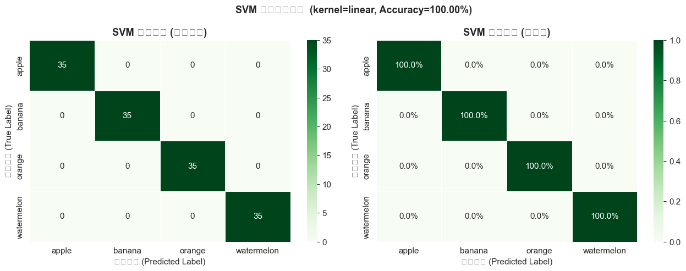

### 說明

- 解讀方式與 KNN 混淆矩陣完全相同，使用**綠色色階**以便與 KNN（藍色）視覺區分。
- 對比兩個混淆矩陣可以看出：哪種演算法在哪個類別的辨識上更準確，以及哪兩類水果最容易被混淆（通常是顏色或形狀相近的水果）。

---

### 7-3 Accuracy / Precision / Recall / F1 比較

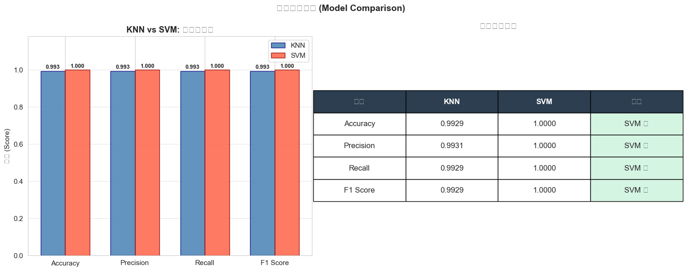

### 說明

**左圖（分組長條圖）**
- 藍色 = KNN，紅色 = SVM，比較四項評估指標。
- 每個長條頂端標示精確數值（越接近 1.0 越好）。

**右圖（摘要比較表）**
- 列出所有指標的數值，並標示「較佳模型（✓）」，讓最終結論一目了然。

**四大指標定義（均使用 `weighted average` 加權平均）：**

| 指標 | 計算方式 | 意義 |
|------|---------|------|
| **Accuracy** | 正確預測數 ÷ 總樣本數 | 整體分類正確率，適合類別平衡時使用 |
| **Precision** | TP ÷ (TP + FP) | 模型說「是這類」時，有多少比例真的對 |
| **Recall** | TP ÷ (TP + FN) | 該類的真實樣本中，被模型找出幾成 |
| **F1 Score** | 2 × (P × R) ÷ (P + R) | Precision 與 Recall 的調和平均數，綜合衡量 |

> TP = True Positive（真陽性）、FP = False Positive（假陽性）、FN = False Negative（假陰性）

---

## 八、[積分題] 獨立載入模型預測

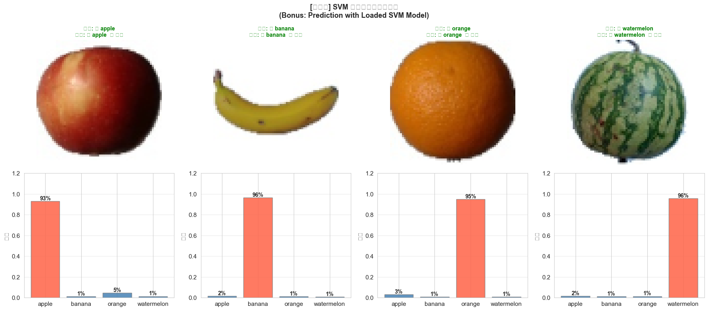

### 說明

此節完全**獨立於訓練過程**，模擬真實的模型部署場景：

1. 從磁碟載入 `saved_models/svm_fruit_classifier.pkl`（或 knn）與 `feature_scaler.pkl`
2. 接收任意輸入影像，提取相同的特徵向量
3. 輸出預測類別與各類別的機率分布

**圖表解讀（每欄一種水果）：**
- **上方**：送入模型的 64×64 px 輸入影像與真實標籤。
- **下方**：模型對四個類別的預測機率長條圖。**紅色長條 = 預測類別（最高機率）**，藍色長條為其他類別。
- ✅ 標示預測正確，❌ 標示預測錯誤。
- 若紅色長條明顯高於其他（如 90% vs 各 3%），代表**模型信心度高**；若多個長條差不多高，代表模型不確定（此時容易出現誤判）。

**命令列使用（積分題交付物）：**
```bash
# 使用 SVM 模型預測
python fruit_predictor.py --image apple.jpg --model svm

# 使用 KNN 模型預測
python fruit_predictor.py --image watermelon.jpg --model knn

# 非水果影像 → 自動輸出「無此項目」
python fruit_predictor.py --image cat.jpg --model svm

# 調整信心度門檻（預設 0.52）
python fruit_predictor.py --image unknown.jpg --threshold 0.65
```

---

## 九、[進階] 無此項目偵測（OOD Detection）

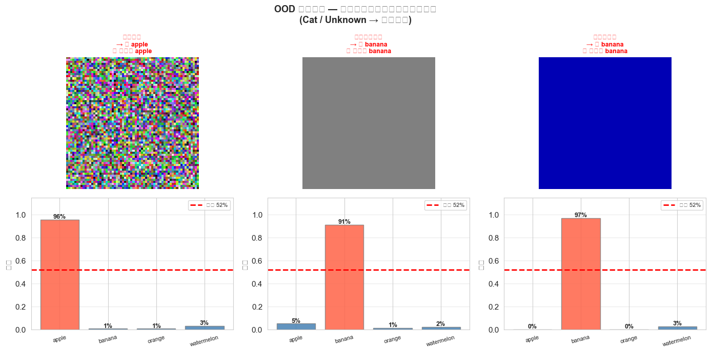

### 說明

**問題背景**：傳統分類器在輸入任何影像時，都會強制從已知類別中選一個輸出，即使輸入是貓、車子或完全不相關的圖片，模型仍會猜一個水果名稱，這樣的輸出毫無意義。

**本專題的解決方案 — 信心度門檻（Confidence Threshold）**：
- 利用 SVM 的 `predict_proba()` 取得對每個類別的預測機率。
- 若**所有類別的機率都低於 52%**（圖中紅色虛線），判定為「❓ 無此項目」，拒絕輸出。
- 若任一類別超過門檻，輸出該類別的預測結果。

**圖表解讀（三欄分別為三種合成非水果影像）：**
- **上方**：輸入影像（隨機雜訊 / 均勻灰色 / 深藍色背景）。
- **下方**：預測機率長條圖。所有長條均低於紅色虛線（52% 門檻），長條顏色為**淺灰色**代表被判定為 Unknown 狀態。
- 三張影像全部正確回傳「❓ 無此項目」，✅ 表示 OOD 偵測成功。

**門檻值說明：**
- 門檻設太高（如 0.9）→ 連正確的水果也會被拒絕（太保守）
- 門檻設太低（如 0.2）→ 非水果也可能被接受（太寬鬆）
- 預設 **0.52** 在本資料集上取得良好的平衡，可透過 `--threshold` 參數調整。

---

## 技術架構總覽

```
資料集：Fruits-360（每類 80 張訓練 / 35 張測試，共 320 / 140 張）
              ↓ 影像縮放至 64×64 px
        ┌─────────────────────────┐
        │      特徵提取（~1910 維）   │
        │  HOG：~1764 維（形狀/紋理）│
        │  RGB 直方圖：96 維（顏色）  │
        │  HSV 直方圖：50 維（色相）  │
        └────────────┬────────────┘
                     ↓ StandardScaler 標準化
            ┌────────┴────────┐
            │                 │
           KNN               SVM
    （5-fold CV             （GridSearchCV
     K = 1~30               Linear / RBF
     最佳 K 值選擇）          C × Gamma 搜索）
            │                 │
            └────────┬────────┘
                     ↓
         評估指標：Accuracy / Precision / Recall / F1
                     ↓
         儲存：saved_models/*.pkl
                     ↓
         獨立預測 + OOD 偵測（信心度門檻 52%）
```
